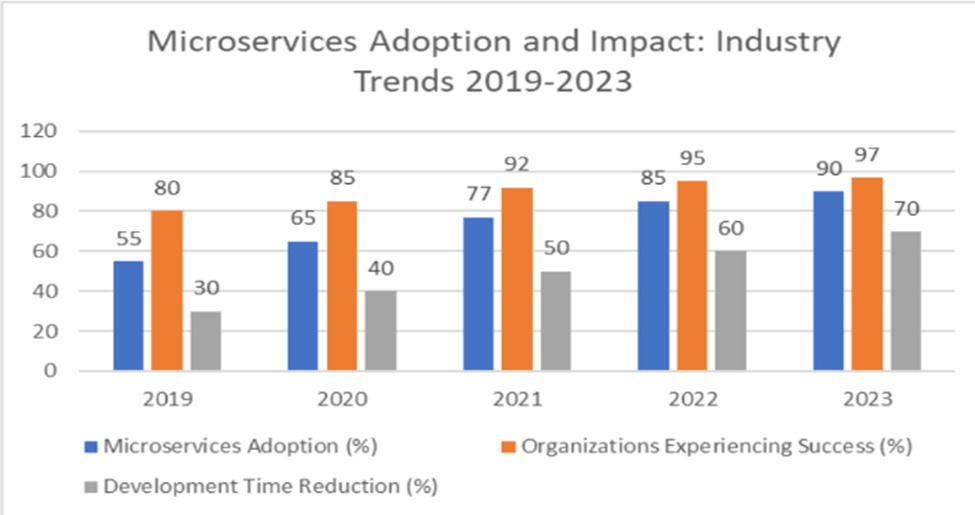
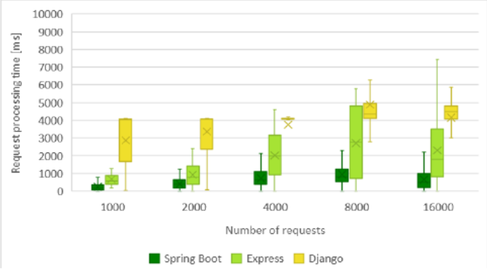
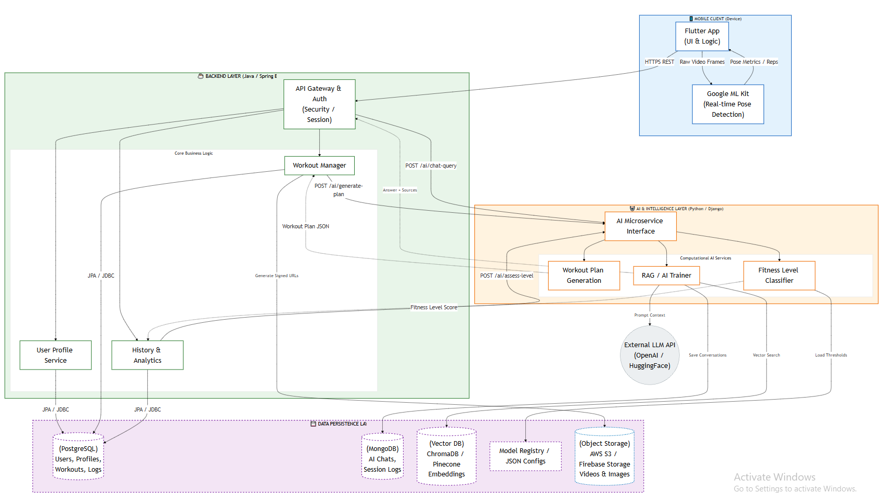
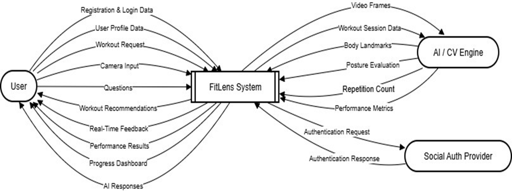
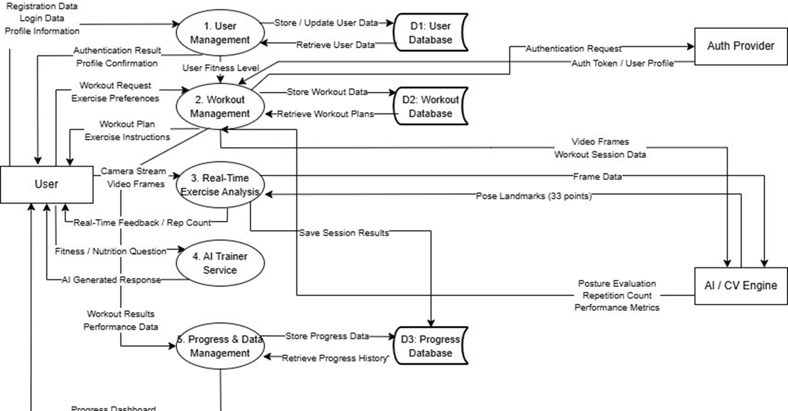
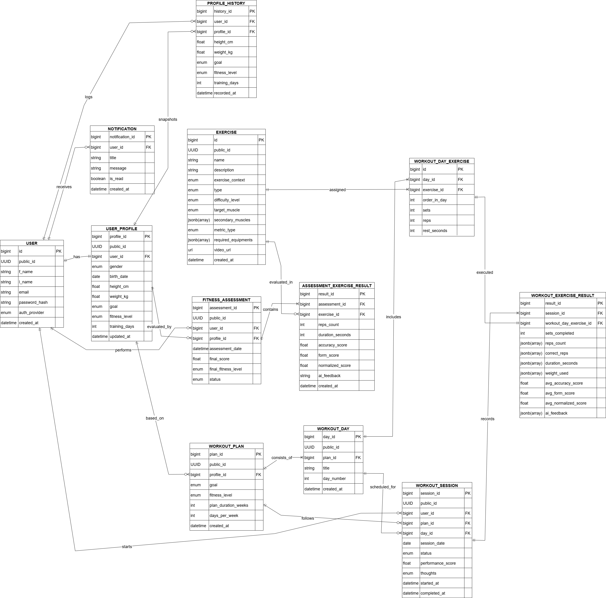

# FitLens: The Intelligent Eye for Safer Fitness

## Project Overview
FitLens is an intelligent fitness ecosystem engineered to remediate the limitations of traditional, static training applications. By integrating Computer Vision and Artificial Intelligence, the platform provides a dynamic alternative to self-assessment through real-time, interactive feedback.

## Technical Stack
* **Backend Framework:** Java 21, Spring Boot 4.0.5
* **Architecture:** Microservices (Spring Cloud, API Gateway, Service Discovery)
* **Primary Database:** PostgreSQL (Relational data persistence and ACID compliance)
* **Caching & Session Management:** Redis (Distributed caching for high-speed data retrieval and session storage)
* **Documentation:** Swagger / OpenAPI 3.0
* **Build Tool:** Maven

## Design Decisions and Justifications

### Architectural Pattern: Microservices
The adoption of a distributed microservices architecture was strategically driven by the need to decouple core business logic from intensive AI computations. By segregating the system into a Spring Boot Core Service and a Django AI Service, the platform leverages technology diversity—utilizing Java’s robust enterprise capabilities for system orchestration and Python’s specialized ecosystem for machine learning and RAG frameworks. This separation ensures independent service scalability, fault isolation, and optimized resource allocation tailored to the specific demands of each service.

### Framework Selection: Spring Boot
Spring Boot was selected as the core orchestration framework due to its superior execution efficiency and reliability under high concurrent loads. Empirical evidence confirms that Spring Boot achieves significantly lower latency for CRUD operations compared to Django and maintains a 0% error rate under heavy traffic (up to 8,000 users). By leveraging its opinionated auto-configuration, development velocity is increased by approximately 71%, while its embedded server architecture supports high throughput (up to 15,000 req/sec), ensuring the low-latency responsiveness critical for the FitLens user experience.

## System Architecture
The following diagram illustrates the overall system structure, highlighting the API Gateway as the single entry point, service discovery mechanism, and inter-service communication protocols.

## System Design and Data Flow

### Data Flow Diagrams (DFD)
The DFD provides a logical representation of the information flow within the system, tracing data from user interaction through the business logic layer to persistence in PostgreSQL.

#### Level 0: Context Diagram

#### Level 1: Process Decomposition

### Database Schema (ERD)
The relational schema is designed in PostgreSQL to ensure data integrity. The model supports complex relationships between workout templates, individual training days, and user-specific progress tracking.

## Core Backend Features
* **Dynamic Workout Planning:** Advanced filtering and search capabilities implemented using JPA Specifications for complex queries.
* **Performance Optimization:** Strategic caching of frequently accessed workout templates and metadata via Redis to reduce database overhead.
* **Asynchronous Communication:** Implementation of event-driven patterns for cross-service data consistency.
* **Standardized Pagination:** Unified paged response structure across all collection endpoints to optimize mobile application performance.
* **Centralized Exception Handling:** Robust error management framework providing consistent and informative API responses.

## API Documentation
The API is fully documented using Swagger/OpenAPI. Documentation provides detailed schemas for requests and responses, including validation constraints. Once the services are active, the documentation can be accessed at:

`http://localhost:[PORT]/swagger-ui.html`

## Execution and Deployment
1.  **Prerequisites:** Ensure PostgreSQL 15+ and Redis 7+ instances are running.
2.  **Configuration:** Update the `application.yml` or `application.properties` in each microservice with the appropriate database credentials and service registry URLs.
3.  **Build:** Execute `mvn clean install` from the root directory.
4.  **Startup Sequence:** * Start the Discovery Service (Eureka).
    * Start the API Gateway.
    * Start the individual functional microservices.